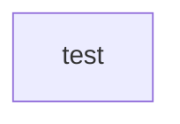
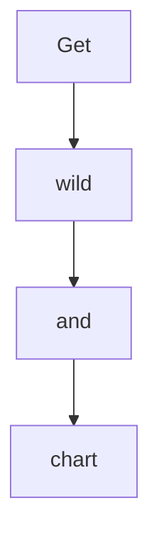
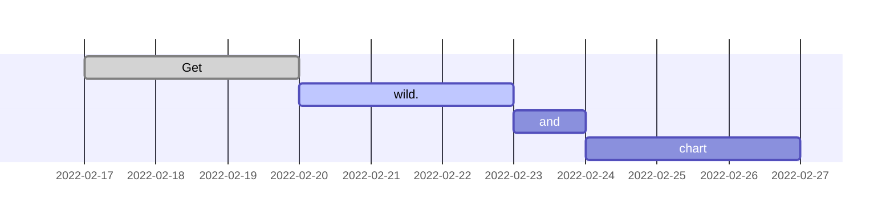

# mermaid-sample
mermaid sample

## Flowchart

## Gantt Chart

# Reference
- https://mermaid-js.github.io/mermaid/
- https://dev.classmethod.jp/articles/mermaid-markdown-is-supported-in-notion/
- https://github.com/amane-uehara/how-to-use-mermaid
- https://zenn.dev/yasuhiroki/articles/dd0feae790ba41
